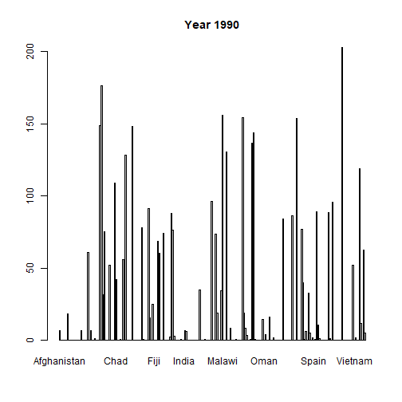
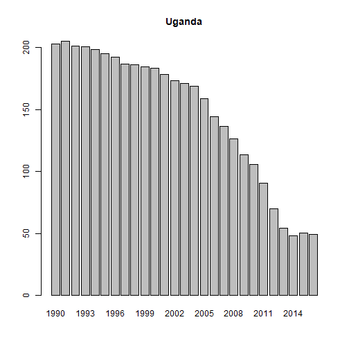
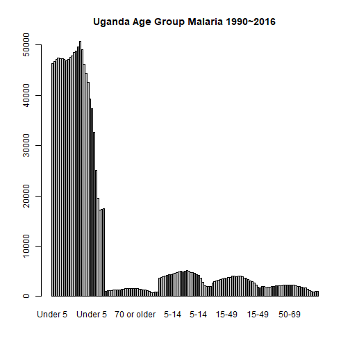

#########################################

url <- "https://raw.githubusercontent.com/rfordatascience/tidytuesday/master/data/2018/2018-11-13/malaria_deaths.csv"
data1 <- read.csv(url)
dim(data1)
names(data1)

url2 <- "https://raw.githubusercontent.com/rfordatascience/tidytuesday/master/data/2018/2018-11-13/malaria_deaths_age.csv"
data2 <- read.csv(url2)
dim(data2)
names(data2)


here is my Plots


```r
barplot(data1$Deaths...Malaria...Sex..Both...Age..Age.standardized..Rate...per.100.000.people., names.arg = data1$Year)
library(knitr); knit('PartOne_Maimanah_Malaria1.Rmd')
```

```
## 
## 
## processing file: PartOne_Maimanah_Malaria1.Rmd
```

```
## 
  |                                                                                                                                                       
  |                                                                                                                                                 |   0%
  |                                                                                                                                                       
  |............                                                                                                                                     |   8%
##   ordinary text without R code
## 
## 
  |                                                                                                                                                       
  |........................                                                                                                                         |  17%
## label: unnamed-chunk-110
```

```
## 
  |                                                                                                                                                       
  |....................................                                                                                                             |  25%
##   ordinary text without R code
## 
## 
  |                                                                                                                                                       
  |................................................                                                                                                 |  33%
## label: unnamed-chunk-111
## 
  |                                                                                                                                                       
  |............................................................                                                                                     |  42%
## label: unnamed-chunk-112
```

```
## 
  |                                                                                                                                                       
  |........................................................................                                                                         |  50%
##   ordinary text without R code
## 
## 
  |                                                                                                                                                       
  |.....................................................................................                                                            |  58%
## label: unnamed-chunk-113
```

```
## 
  |                                                                                                                                                       
  |.................................................................................................                                                |  67%
##   ordinary text without R code
## 
## 
  |                                                                                                                                                       
  |.............................................................................................................                                    |  75%
## label: unnamed-chunk-114
```

```
## 
  |                                                                                                                                                       
  |.........................................................................................................................                        |  83%
##   ordinary text without R code
## 
## 
  |                                                                                                                                                       
  |.....................................................................................................................................            |  92%
## label: unnamed-chunk-115
## 
  |                                                                                                                                                       
  |.................................................................................................................................................| 100%
##   ordinary text without R code
```

```
## output file: PartOne_Maimanah_Malaria1.md
```

```
## [1] "PartOne_Maimanah_Malaria1.md"
```
There is no trend for Global Malaria Deaths between 1990 ~ 2016, with unfiltered data.


```r
filter1 <- data1[data1$Year %in%c("1990"),  ]
names(filter1)
```

```
## [1] "Entity"                                                                          
## [2] "Code"                                                                            
## [3] "Year"                                                                            
## [4] "Deaths...Malaria...Sex..Both...Age..Age.standardized..Rate...per.100.000.people."
```

```r
filter2 <- data1[data1$Entity %in% c("Uganda"),  ]
names(filter2)
```

```
## [1] "Entity"                                                                          
## [2] "Code"                                                                            
## [3] "Year"                                                                            
## [4] "Deaths...Malaria...Sex..Both...Age..Age.standardized..Rate...per.100.000.people."
```

```r
filter3 <- data2[data2$entity %in% c("Uganda"),  ]
names(filter3)
```

```
## [1] "X"         "entity"    "code"      "year"      "age_group" "deaths"
```

```r
filter4 <- filter3[filter3$year %in% c("1990"),  ]
names(filter4)
```

```
## [1] "X"         "entity"    "code"      "year"      "age_group" "deaths"
```

```r
barplot(filter1$Deaths...Malaria...Sex..Both...Age..Age.standardized..Rate...per.100.000.people., names.arg = filter1$Entity,
        main = "Year 1990")
```


Boxplot of Malaria Deaths in 1990 across the globe. Highest peak is the country of Uganda.


```r
barplot(filter2$Deaths...Malaria...Sex..Both...Age..Age.standardized..Rate...per.100.000.people., names.arg = filter2$Year,
        main = "Uganda")
```


Focusing on Uganda only, there is a downtrend of Malaria deaths from 1990 to 2016, with advancement of knowledge and medical facilities.


```r
barplot(filter3$deaths, names.arg = filter3$age_group,
        main = "Uganda Age Group Malaria 1990~2016")
```


Uganda Age-group of Malaria deaths, is extremely high for children under age of 5. Focus group to manage wil be under 5.


```r
library(knitr); knit('PartOne_Maimanah_Malaria1.Rmd')
```

```
## 
## 
## processing file: PartOne_Maimanah_Malaria1.Rmd
```

```
## Error in parse_block(g[-1], g[1], params.src, markdown_mode): Duplicate chunk label 'unnamed-chunk-2', which has been used for the chunk:
## barplot(data1$Deaths...Malaria...Sex..Both...Age..Age.standardized..Rate...per.100.000.people., names.arg = data1$Year)
## library(knitr); knit('PartOne_Maimanah_Malaria1.Rmd')
```

